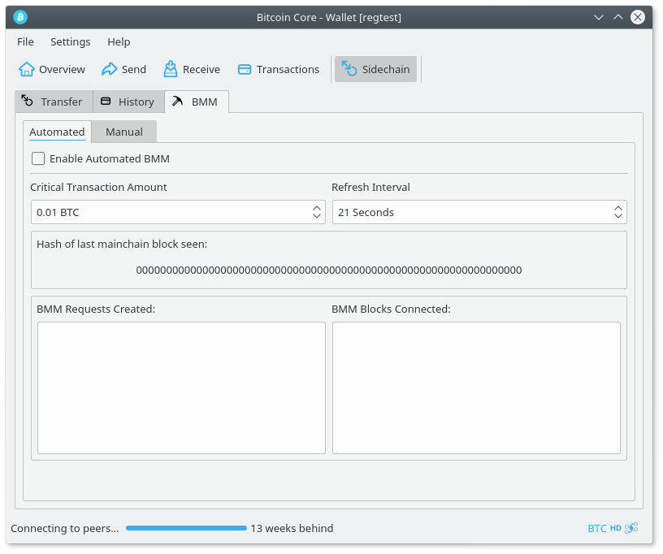
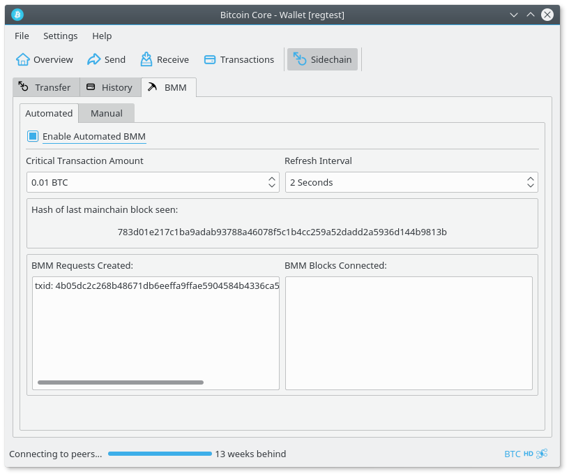
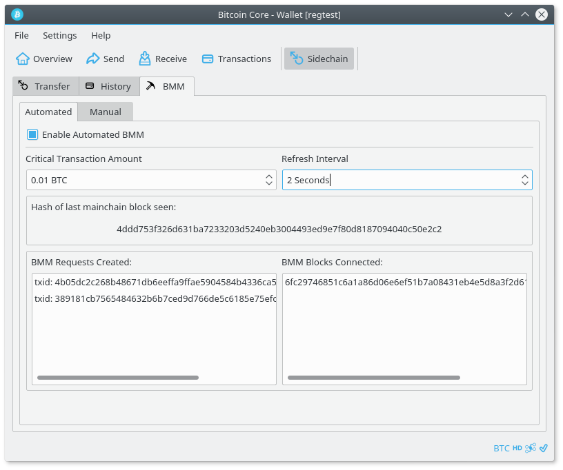

Testing Drivechains
===================

Setup
-----
- Create directories to store the mainchain and sidechain repositories
```
mkdir -p ~/drivechain/{mainchain,sidechain}
```

- Create directories for mainchain and sidechain datadir
```
mkdir -p ~/drivechain/data/{maindata,sidedata}
```

`Note: this guide will assume that you have created the same directories`

### Mainchain (bitcoin) setup
- Clone repository and checkout mainchain branch

`Note: Optionally keep a copy of the downloaded bitcoin/ repo to skip cloning again later`
```
cd ~/drivechain/mainchain/
git clone https://github.com/drivechain-project/bitcoin.git
cd bitcoin/
git checkout mainchainBMM
```

- Build
```
./autogen.sh
./configure
make
```

- Configuration file

Copy the main.conf configuration file from the [Drivechain testing repository](https://github.com/drivechain-project/testing)

to ~/drivechain/data/maindata/bitcoin.conf
`Note: Make sure you name the file bitcoin.conf`

### Sidechain setup
- Clone repository and checkout sidechain branch
```
cd ~/drivechain/sidechain/
git clone https://github.com/drivechain-project/bitcoin.git
cd bitcoin/
git checkout sidechainBMM
```

- Build
```
./autogen.sh
./configure
make
```

- Configuration file

Copy the side.conf configuration file from the [Drivechain testing repository](https://github.com/drivechain-project/testing)

to ~/drivechain/sidedata/bitcoin.conf
`Note: Make sure you name the file bitcoin.conf`

Running unit tests
------------------
From the mainchain directory (~/drivechain/mainchain/)
run all of the Drivechain & Bitcoin unit tests:
```
make check
```

To individually run just the Drivechain unit tests:
```
src/test/test_bitcoin --log_level=all --run_test=sidechaindb_tests
src/test/test_bitcoin --log_level=all --run_test=transaction_criticaldata_tests
src/test/test_bitcoin --log_level=all --run_test=bmm_tests
```

Manual testing
--------------
### Get everything started
- Start mainchain (bitcoin)

```
~/drivechain/mainchain/bitcoin/src/qt/bitcoin-qt --datadir=/home/$(whoami)/drivechain/data/maindata/ &
```

- Start sidechain

```
~/drivechain/sidechain/bitcoin/src/qt/bitcoin-qt --datadir=/home/$(whoami)/drivechain/data/sidedata/ &
```

Both clients (sidechain & mainchain) should start in regtest mode, note the
blue icon. If not, you need to make sure you saved the configuration files
correctly and started the clients with the proper datadir specified.

### Generate coins on mainchain

- Mine 101 blocks on the mainchain to get coins

Open the debug window, switch to the console tab and enter:
```
generate 101
```

### Create deposit from mainchain to sidechain

- Deposit to sidechain

First, get a deposit address from the sidechain tab of the `sidechain` bitcoin-qt.


Then, go to the send page of the `mainchain` bitcoin-qt client, click send (sidechain)
which is located at the bottom of the page in the same row of buttons as the
normal Send button. The sidechain deposit dialog will pop up.

Paste the sidechain deposit address into the deposit dialog open on the
`mainchain` client.

Enter the amount you wish to deposit. In this example we will send 21 BTC to the
sidechain.


Click the deposit button. Upon success the results will be displayed, or an
error message if there were issues.


Generate a block on `mainchain` to add the deposit to the Sidechain DB.
```
generate 1
```

### Now we need to start generating sidechain BMM blocks. We need at least one to see our deposit.

Go to the BMM tab of the sidechain and check the 'Automated BMM' checkbox. You may also want
to configure the refresh interval (I usually set this to 2 seconds)



This page will automatically generate a sidechain BMM block, create a BMM commit
request on the mainchain, and process the BMM block once it has been committed to
on the mainchain (by mining a mainchain block).
Once you see that the sidechain has created a BMM request (it will be listed under
'BMM Requests Created') you will need to mine a block on the mainchain to process
the BMM request. The sidechain will then be able to submit the BMM block we created
earlier and extend the side chain.



On the mainchain:
```
generate 1
```

After the first sidechain BMM block is connected, you should see that your deposit
went through to your sidechain deposit address. Now you must generate another 6
blocks, for the deposit to mature and become spendable. (Note that the deposit
maturity requirement has been reduced from 100 to 6 for testing)



### Withdraw from sidechain to mainchain

- Withdraw from sidechain

With the `sidechain` client open, visit the sidechain tab.

Click withdraw, enter the `mainchain` bitcoin address that you would like to
withdraw to and the amount to withdraw. In this example we will withdraw 7 BTC
from the sidechain and send it back home to bitcoin.


Click the withdraw button to broadcast it.

### Trigger WT^ creation, verification and payout

- Generate enough mainchain blocks (which will also create sidechain BMM blocks)
to trigger the creation, broadcast and eventual payout of a WT^.

`WT^ = grouped withdrawal transactions to be validated by mainchain`

Repeat what you did to process your deposit:
Generate 1 block on the mainchain, and wait for the BMM Automation page to detect
this block. The hash of the most recent mainchain block processed will be shown on
the BMM Automation tab for convenience.

On the mainchain:
```
generate 1
```

After you've generated 10 blocks, the WT^ will be broadcast to the mainchain.
(```tail -F debug.log``` for main & side if you'd like to watch this)

Now that the mainchain knows about the WT^, we must generate sufficient
workscore for the WT^ to be valid for payout. To do this we must keep generating
mainchain (and thus sidechain) blocks.

- Generate blocks on the mainchchain to add the WT^ to the DB and start the
verification process

On the mainchain:
```
generate 1
```

Repeat this until the mainchain block height reaches at least 140 which will
trigger WT^ payout if a WT^ from the test sidechain has sufficient workscore.
(Note that this workscore and verification period have both been reduced from
thousands of blocks for testing purposes)


If you received the 7 (~6.9 with fee removed) BTC withdrawal that you created
on the sidechain, everything worked. If not, feel free to open a github issue
after double checking the following:

### If you encounter an error, start here:
Confirm the following:
- You have setup the configuration files as instructed
- You launched bitcoin-qt with the correct parameters
- You have checked out the mainchain and sidechain branches in the correct directories

`The further you stray from this guide the more likely you are to experience
unknown bugs. Please experiment and report issues via github!`


[Submit issues here](https://github.com/drivechain-project/bitcoin/issues)
